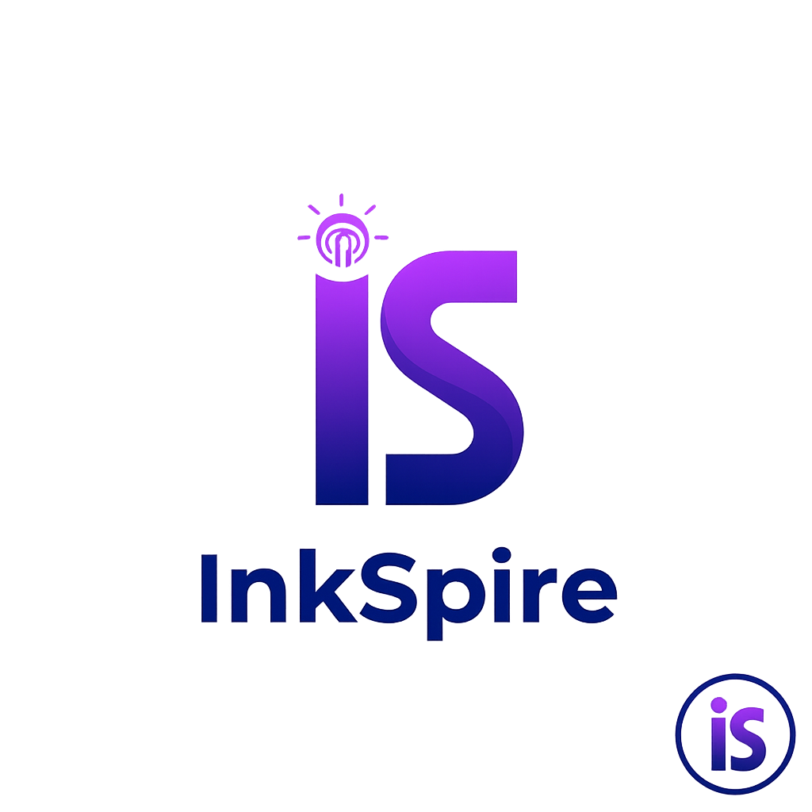

<p align="center">
  
</p>

# InkSpire Frontend

## ⚠️ WARNING: Under Heavy Development ⚠️

**This project is currently under active and heavy development. It is NOT ready for general use and may contain bugs, incomplete features, or breaking changes. Use at your own risk.**


InkSpire is a modern web-based text editor designed for writers who want to leverage the power of AI to enhance their creative process. It provides a clean and organized interface for managing files and directories, along with AI-powered tools to rephrase, translate, and generate text.

---

## ✨ Features

- **AI-Powered Writing Tools**  
  Rephrase, translate, or expand text directly in your editor.
- **File System Navigation**  
  Hierarchical tree view to organize and manage your files.
- **Clean and Focused Editor**  
  A distraction-free writing environment with a modern interface.
- **Authentication**  
  Secure login system to protect your workspace.
- **Dynamic UI**  
  Smooth, interactive menus and modals for a polished user experience.

---

## 🧠 Technology Stack

- [Vue.js](https://vuejs.org/) — The Progressive JavaScript Framework
- [Vite](https://vitejs.dev/) — Next Generation Frontend Tooling
- [TypeScript](https://www.typescriptlang.org/) — Strongly-typed JavaScript for safer development

---

## 🚀 Getting Started

### Prerequisites

- [Node.js](https://nodejs.org/) v20 or later  
- npm (comes with Node.js)

### Installation

```bash
git clone <repository-url>
cd inkspire-frontend
npm install
npm run dev
````

Then open [http://localhost:5173](http://localhost:5173) in your browser.
The app reloads automatically when you make source code changes.

---

## 🧪 Quality and Testing

InkSpire uses **AI-assisted development** tools to accelerate coding, followed by **human validation** and **automated tests** for correctness.

Run unit tests:

```bash
npm run test:unit
```

Build for production:

```bash
npm run build
```

Continuous integration and expanded test coverage are being progressively integrated.

---

## 📜 License

This project is released under the [MIT License](LICENSE).
It is provided *as is*, without warranty, but every effort is made to ensure code reliability and responsible use of AI-generated components.

---

## 💬 Acknowledgments

InkSpire is based on a code developped by:

- [Evann Abrial](https://www.linkedin.com/in/evann-abrial-26b446297/)
- [Lola Chalmin](https://www.linkedin.com/in/lola-chalmin-112ab9290/)
- [Roxane Rossetto](https://www.linkedin.com/in/roxane-rossetto-3b9158211/)

---

*© 2025 InkSpire. Built with care, code, and a bit of inkSpiration.*
